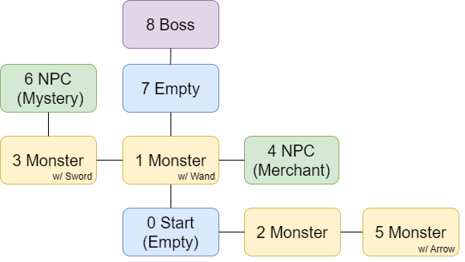
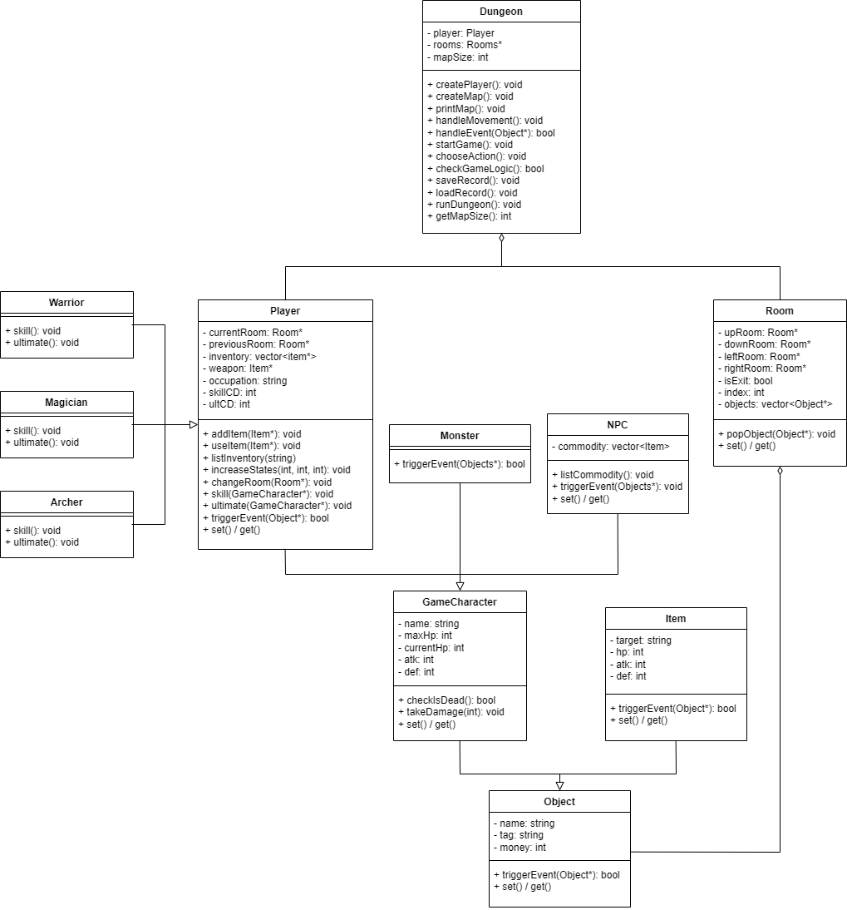

# Dungeon

> This is the midterm project for course Data Structures and Object-oriented Programming in NYCU.
> More course info:
> - Lecturer：詹力韋
> - Semester：111-2, 2023 Spring
> - [Syllabus](https://timetable.nycu.edu.tw/?r=main/crsoutline&Acy=111&Sem=2&CrsNo=515506&lang=zh-tw)

## Introduction
Dungeon is a C++ based dungeon adventure game where players can explore dungeons, fight monsters, and collect items.  It leverages the advantages of OOP, such as polymorphism and encapsulation, to implement complex game logic. It features systems for character occupations, battle mechanics, and saving/reading files. Additionally, it incorporates error handling and input validation to process various input cases, including uppercase, lowercase, and invalid inputs.

## Play
You can directly click one file (corresponding to your system) and start play
|                  Windows                 |            Ubuntu            |
| ---------------------------------------- | ---------------------------- |
| [main_windows.exe](src/main_windows.exe) | [main_linux](src/main_linux) |

## Compile & Run
Please clone this repository and run the following commands:
```sh
git clone https://github.com/Sean20405/Dungeon.git  # Clone the repo
cd Dungeon/src
g++ *.cpp -o main.exe                               # Compile, link and output
./main.exe                                          # Run the file
```

Alternatively, if you have make installed, you can run make directly to get the executable file.

## Features
- Map Creation: The game includes a map with various rooms.
- Player Creation: Players can choose their name and occupation (Warrior, Magician, Archer).
- Weapon equipment: Players can find and equip different weapons, each with unique attributes and effects on gameplay.
- Skill and CD system: Players have different skill and ultimate, but both have cooldown time.
- Game Logic: The game includes logic for handling player movements, interactions, and game state checks.
- Save/Load: Players can save and load their game progress.

## Acknowledgments
Thanks to [@nlohmann](https://github.com/nlohmann) for providing such useful JSON tools for C++. [nlohmann/json](https://github.com/nlohmann/json)

## Supplement
- [report.pdf](report.pdf): A comprehensive overview of the game, covering game logic, implementation details, and reflections on the development process. (Written in Chinese)
- map
    <div align="center">
        
    </div>
- UML
    <div align="center">
        
    </div>
- [Demo Video](https://youtu.be/Qb45GCcZc4w)